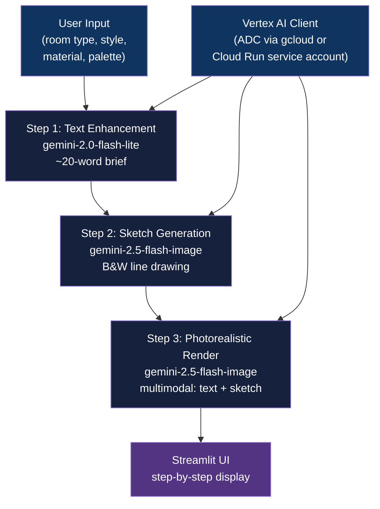

<div align="center">

# Google Cloud AI Studio

[](https://www.python.org/downloads/)
[](https://streamlit.io)
[](LICENSE)
[](https://google-cloud-ai-studio-1099058340933.us-central1.run.app)

**Generative interior design app: 3-stage Gemini pipeline (prompt rewrite -> sketch -> photorealistic render) on Cloud Run**

[Getting Started](#getting-started) | [Usage](#usage) | [Architecture](#architecture)

</div>

---

## Table of Contents

- [The Problem](#the-problem)
- [Features](#features)
- [Tech Stack](#tech-stack)
- [Architecture](#architecture)
- [Getting Started](#getting-started)
  - [Prerequisites](#prerequisites)
  - [Installation](#installation)
  - [Configuration](#configuration)
- [Usage](#usage)
- [How It Works](#how-it-works)
- [Architectural Decisions](#architectural-decisions)
- [Project Structure](#project-structure)
- [Deployment](#deployment)
- [Related Projects](#related-projects)
- [License](#license)
- [Author](#author)

## The Problem

### Bridging Design Intent and Visual Output

Describing a room design in text rarely produces a useful visual result with a single model call. Prompt nuance gets lost, spatial relationships are vague, and the jump from words to photorealistic imagery is too large for one inference step.

### The Solution

A chained 3-stage Gemini pipeline separates concerns: a lightweight text model sharpens the brief first, then an image model generates a line-sketch with spatial structure, then a second image-model pass renders that sketch into a photorealistic archviz output. Each stage produces a visible intermediate result in the Streamlit UI.

## Features

- **3-stage generative pipeline** - text enhancement, architectural sketch, and photorealistic render as discrete steps with visible intermediates
- **Dual-model orchestration** - `gemini-2.0-flash-lite` for text, `gemini-2.5-flash-image` for both image stages, each tuned to its task
- **Vertex AI ADC auth** - no API keys in code; works locally via `gcloud auth application-default login` and on Cloud Run via the attached service account
- **Configurable model selection** - override `MODEL_TEXT` and `MODEL_IMAGE` env vars without touching source code
- **Streamlit live status** - connection health indicator on page load; per-step progress with Streamlit's `st.status` widget
- **Docker + Cloud Run deployment** - single `Dockerfile` with uv for fast installs, deployed to the managed Cloud Run URL

## Tech Stack

| Component | Technology |
|-----------|------------|
| Language | Python 3.12+ |
| Package manager | uv |
| Frontend | Streamlit 1.30+ |
| Text model | gemini-2.0-flash-lite |
| Image model | gemini-2.5-flash-image |
| AI SDK | google-genai 1.0+ |
| Container | Docker (python:3.12-slim) |
| Cloud | Google Cloud Run (us-central1) |

## Architecture



## Getting Started

### Prerequisites

- Python 3.12+
- [uv](https://github.com/astral-sh/uv) package manager
- Google Cloud project with Vertex AI API enabled
- `gcloud` CLI authenticated (`gcloud auth application-default login`)

### Installation

1. Clone the repository:
   ```bash
   git clone https://github.com/adityonugrohoid/google-cloud-ai-studio.git
   cd google-cloud-ai-studio
   ```

2. Install dependencies with uv:
   ```bash
   uv sync
   ```

### Configuration

Set the required environment variables before running:

```bash
export GOOGLE_CLOUD_PROJECT=$(gcloud config get-value project)
export GOOGLE_CLOUD_REGION="us-central1"
```

Optional overrides (defaults shown):

| Variable | Default | Description |
|----------|---------|-------------|
| `GOOGLE_CLOUD_PROJECT` | - | GCP project ID (required) |
| `GOOGLE_CLOUD_REGION` | `us-central1` | Vertex AI region |
| `MODEL_TEXT` | `gemini-2.0-flash-lite` | Model for step 1 text enhancement |
| `MODEL_IMAGE` | `gemini-2.5-flash-image` | Model for steps 2 and 3 image generation |

## Usage

```bash
uv run streamlit run app.py
```

Open `http://localhost:8501` in your browser. Select room type, design style, material, and color palette, then click "Generate Design". The app shows each pipeline step as it completes.

**Live deployment:** [https://google-cloud-ai-studio-1099058340933.us-central1.run.app](https://google-cloud-ai-studio-1099058340933.us-central1.run.app)

## How It Works

### Step 1 - Text Enhancement

`step1_enhance_prompt()` calls `gemini-2.0-flash-lite` with a strict prompt to expand the user's structured inputs into a concise 1-2 sentence design brief (capped at 20 words, `max_output_tokens=50`). The tight constraint prevents verbose output that would confuse the image stages.

### Step 2 - Architectural Sketch

`step2_generate_sketch()` calls `gemini-2.5-flash-image` with explicit constraints for a pure black-and-white line drawing: no shading, no color, no grayscale. The structured prompt enforces perspective and furniture layout. The response is parsed by iterating `response.candidates[0].content.parts` to extract the `inline_data` image bytes.

### Step 3 - Photorealistic Render

`step3_generate_render()` sends a multimodal request to `gemini-2.5-flash-image`: the render style prompt plus the sketch bytes as a `Part(inline_data=...)` object. The model uses the sketch's spatial structure as reference geometry for ray-traced lighting, realistic textures, and lens effects. `temperature=0.0` keeps the output deterministic.

## Architectural Decisions

### 1. Vertex AI ADC over direct API key

**Decision:** The client is always initialized via `genai.Client(vertexai=True, project=..., location=...)`, relying entirely on Application Default Credentials.

**Reasoning:** Cloud Run attaches a service account automatically, so the same code path works both locally (via `gcloud auth application-default login`) and in production without injecting secrets. No API key rotation, no secret manager wiring.

### 2. uv in Docker for dependency installs

**Decision:** The Dockerfile copies the `uv` binary from `ghcr.io/astral-sh/uv:latest` and runs `uv pip install --system .` rather than using pip directly.

**Reasoning:** uv resolves and installs the locked dependency set significantly faster than pip in cold-build scenarios, which matters for Cloud Build turnaround time. The `--system` flag avoids creating a venv layer inside the container.

### 3. Three discrete model calls rather than a single multimodal prompt

**Decision:** Text enhancement, sketch generation, and render are three separate API calls rather than a single complex prompt.

**Reasoning:** Each model call has a narrowly scoped task and explicit output constraints. Chaining lets each stage validate its output before proceeding, surfaces failures at the right step, and lets the Streamlit UI show real intermediates instead of a single opaque wait.

## Project Structure

```
google-cloud-ai-studio/
├── app.py                         # Single-file Streamlit application (all 3 pipeline stages)
├── Dockerfile                     # python:3.12-slim + uv, exposes port 8080
├── pyproject.toml                 # Project metadata and dependencies
├── uv.lock                        # Pinned dependency lockfile
└── LICENSE
```

## Deployment

### Local Development

```bash
export GOOGLE_CLOUD_PROJECT=$(gcloud config get-value project)
export GOOGLE_CLOUD_REGION="us-central1"
gcloud auth application-default login
uv run streamlit run app.py
```

### Docker (local)

```bash
docker build -t google-cloud-ai-studio .
docker run -p 8080:8080 \
  -e GOOGLE_CLOUD_PROJECT=your-project-id \
  -e GOOGLE_CLOUD_REGION=us-central1 \
  -v ~/.config/gcloud:/root/.config/gcloud:ro \
  google-cloud-ai-studio
```

### Google Cloud Run

Build and push to Container Registry:

```bash
gcloud builds submit --tag gcr.io/$GOOGLE_CLOUD_PROJECT/google-cloud-ai-studio
```

Deploy to Cloud Run:

```bash
gcloud run deploy google-cloud-ai-studio \
  --image gcr.io/$GOOGLE_CLOUD_PROJECT/google-cloud-ai-studio \
  --platform managed \
  --allow-unauthenticated \
  --region $GOOGLE_CLOUD_REGION
```

The deployed service uses the Cloud Run service account for Vertex AI ADC auth - no additional secret configuration required.

## Related Projects

| Project | Description |
|---------|-------------|
| [google-ai-studio](https://github.com/adityonugrohoid/google-ai-studio) | TypeScript/Next.js sibling - same 3-stage pipeline via Google AI SDK, deployed on Vercel instead of Cloud Run |

## License

This project is licensed under the [MIT License](LICENSE).

## Author

**Adityo Nugroho** ([@adityonugrohoid](https://github.com/adityonugrohoid))
